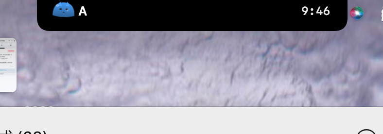
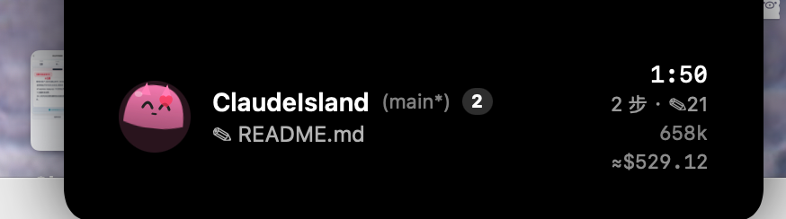
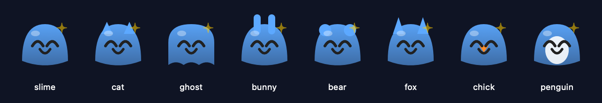

# Claude Island

Mac 灵动岛(Dynamic Island)实时监控 Claude Code CLI 进度。
菜单栏常驻小程序,把每个 Claude Code 会话的状态投到 MacBook 刘海:**工作中 / 需要你介入 / 完成**。配一只随状态变情绪的桌宠 Cody(可换色换皮)。



> 需要:macOS 14+、带刘海的 MacBook(无刘海自动降级为浮窗)、已装 Claude Code。

## 快速开始

**① 下载预编译版**(免编译):[**最新 Release**](https://github.com/pant0m/ClaudeIsland/releases/latest) → 下载 zip → 解压 → 把 `ClaudeIsland.app` 拖进 `/Applications` → **右键打开**(未公证,首次需右键)→ 点「**Set Up**」自动接线。

**② 或从源码构建**:
```bash
git clone https://github.com/pant0m/ClaudeIsland && cd ClaudeIsland
scripts/setup.sh        # 装 hook 生产者 + 接线 settings.json + 构建 .app + 开机自启
```

菜单栏出现 ✨,刘海里出现 Cody。卸载:`scripts/uninstall.sh`。

## 架构

```
Claude Code(任意多会话)
   │  生命周期 hooks
   ▼
~/.claude/island/claude-island.py   读 hook stdin JSON,加锁 + 原子写
   ▼
~/.claude/island/state.json         单一事实来源,按 session_id 分组
   │  App 用 FSEvents 监听目录(写入即时反应)+ 2s 兜底轮询
   ▼
ClaudeIsland.app  →  DynamicNotchKit 渲染到刘海
```

用文件做管道:简单、可调试(`cat state.json` 即可)、不占端口、丢事件也能自愈。

## 三种状态

| 状态 | 触发 hook | 刘海表现 |
|---|---|---|
| working 工作中 | UserPromptSubmit / PreToolUse | 蓝色 spinner + 项目首字母 + 计时(紧凑态);PreToolUse 把当前动作人话化:`$ npm test` / `✎ foo.ts` / `📖 README` |
| attention 需要你介入 | Notification | 展开琥珀面板 + 蜂鸣,显示权限请求 / 等待输入消息 |
| done 完成 | Stop | 绿勾 + 总耗时 + 步数,4 秒后自动收起 |

多会话:按 `attention > working > done` 优先级择一主显示,展开态右上角显示并发会话数。无刘海的 Mac 自动降级为浮窗。

悬停刘海展开详情卡片 —— 项目 `(分支*)` · 当前动作 · 计时 · `✎改动文件` · 上下文 · `≈花费`,右上角 `2` 为并发会话数:



## 文件

- `hooks/claude-island.py` — hook 生产者(Python,零三方依赖);`setup.sh` 装到 `~/.claude/island/`
- `~/.claude/island/state.json` — 实时状态(运行时生成)
- `~/.claude/settings.json` — hooks 接线(`SessionStart` `UserPromptSubmit` `PreToolUse` `PostToolUse` `Notification` `Stop` `SessionEnd`)
- `ClaudeIsland/Sources/ClaudeIsland/` — 消费者 App
  - `Island.swift` — state.json 模型 + 会话选择逻辑 + 僵尸会话收割
  - `Notch.swift` — DynamicNotchKit 控制器 + SwiftUI 视图
  - `Pet.swift` — 刘海宠物 Cody(纯 SwiftUI,情绪随状态)+ 应用图标 `IconView`
  - `Config.swift` — 读 `config.json`:换色 / 换皮(slime/cat/ghost)/ 按项目配色
  - `Focus.swift` — 点击按 tty 跳回终端 + attention 系统通知 `Notifier`
  - `Icon.swift` — 用 `ImageRenderer` 把 Cody 渲染成 macOS `.iconset`
  - `main.swift` — 菜单栏 agent 入口 + FSEvents 监听(诊断:`--dump` / `--focus` / `--notify` / `--icon`)
- `scripts/setup.sh` — 一键:装 hook + 接线 `settings.json` + 构建安装 App
- `scripts/install.sh` `uninstall.sh` — 打包 release `.app`(渲染图标 + 自动签名,无证书回退 ad-hoc)+ 开机自启的装 / 卸
- `config.example.json` — 宠物配置模板

## 安装 / 卸载(推荐)

```bash
scripts/install.sh      # 构建 release → ~/Applications/ClaudeIsland.app → 装 LaunchAgent 开机自启
scripts/uninstall.sh    # 移除自启 + 停止 App(.app 保留,hooks 不动)
```

装好后菜单栏出现 ✨ 图标,每次开机自动拉起,脱离终端常驻。改了代码重跑 `install.sh` 即热更新。

## 临时跑(开发)

```bash
swift build && ./.build/debug/ClaudeIsland &    # 调试构建
pkill -f 'ClaudeIsland/.build'                  # 退出
```

## 自定义宠物

编辑 `~/.claude/island/config.json`,**改完即时生效**(App 在监听这个目录,无需重启):

```json
{
  "style": "cat",                 // slime · cat · ghost · bunny · bear · fox · chick · penguin
  "color": "#4aa3ff",             // 全局「工作中」颜色
  "projects": {                   // 按项目覆盖颜色,多会话时一眼区分
    "my-project": "#ff7eb6"
  }
}
```

模板见 `config.example.json`。8 种皮肤共用同一只身体,靠耳朵/喙/肚皮区分:



颜色只改「工作中」态;**`attention` 恒为橙、`done` 恒为绿**,保住「橙=需要你」的关键信号。删掉文件或留空 = 默认蓝史莱姆。

## 关闭监控

删掉 `~/.claude/settings.json` 里的 `"hooks"` 块即可。即使 App 没开,hooks 也只是更新一个极小的 JSON 文件,无副作用。

## 路线图(v2)

- [x] **刘海宠物 Cody** — 纯 SwiftUI 史莱姆,情绪随状态(跑 / 抖 / 跳 / done 后躺下打盹 Zzz)
- [x] **收割僵尸会话** — hook 记录 Claude 进程 pid,`kill(pid,0)` 判死;进程没了的会话立刻从刘海剔除(`--dump` 可诊断)
- [x] **点击刘海 → 跳回对应终端** — hook 记录 `TERM_PROGRAM` + tty;点药丸/面板用 AppleScript 按 tty 精确选中 Terminal/iTerm 的窗口标签,其它终端兜底前置(`--focus` 可测)
- [x] **菜单栏 = 全部会话实时列表** — `NSMenuDelegate` 开菜单时即时重建:彩色状态点 + 项目 + 计时(attention 显示「等 N」)+ 当前动作,点条目跳回该会话终端;僵尸 / 旧 done 自动隐藏
- [x] **token / 花费** — Stop 时扫 transcript JSONL,按模型定价估算累计成本 + 当前上下文大小;菜单每行显示 `ctx ≈$`,底部「合计」,notch 展开也带 `≈$`
- [x] **宠物性格化** — 上下文越满 Cody 越胖(ctx→体宽),单轮跑越久越累(困脸半睁眼 + 步子变沉 + 冒汗珠 💧)
- [x] **打包 `.app` + 开机自启** — `scripts/install.sh` 构建 release、装到 `~/Applications/ClaudeIsland.app`(`LSUIElement`,仅菜单栏)、写 LaunchAgent 开机自启;`scripts/uninstall.sh` 一键卸载
- [x] **系统通知 + 免打扰** — attention 用 `osascript display notification`(横幅 + Submarine 声)替代裸 beep;macOS 在专注模式/DND/屏幕共享时自动按系统设置静音,无需脆弱的状态探测
- [x] **文件监听替代轮询** — `DispatchSource` 监听 `~/.claude/island/` 目录(盯目录而非文件,扛得住原子 rename 换 inode),写入即时 `tick()`;轮询降到 2s 仅兜底进程猝死这类无写入的时间型变化
- [x] **应用图标 + 代码签名** — 用 `ImageRenderer` 把 Cody 渲染成 `.icns`(图标=宠物本体);`install.sh` 自动用 Apple Development 证书签名(钥匙串卡住 20s 自动回退 ad-hoc),`codesign --verify` 通过
- [x] **宠物交互** — 悬停时 Cody 眼睛追你的鼠标并精神一振(`.onContinuousHover`);点击在跳回终端的同时「摸一下」它(开心弹跳 + 冒粉色爱心,约 1s)
- [x] **换色 / 换皮** — `config.json` 实时配置:全局/按项目颜色 + 8 种皮肤(slime/cat/ghost/bunny/bear/fox/chick/penguin),改 JSON 立即生效
- [x] **Git 分支 + 改动量** — 菜单每行显示 `(分支*)`(开菜单时现查 git,detached 显示短 hash)+ `✎N`(本会话改过的不同文件数,从 transcript 去重统计)
- [x] **悬停看详情卡片** — 鼠标移到刘海即展开:`项目 (分支*) · 当前动作 · 计时 · N步 ✎文件 · ctx · ≈花费`;离开收回,点击仍跳终端(悬停看、点击去,互不冲突)

## 致谢 / License

- 刘海渲染基于 [DynamicNotchKit](https://github.com/MrKai77/DynamicNotchKit)。
- MIT License,见 [LICENSE](LICENSE)。
